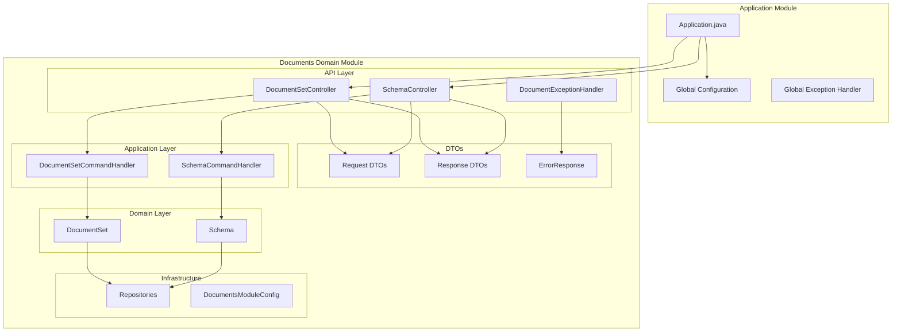
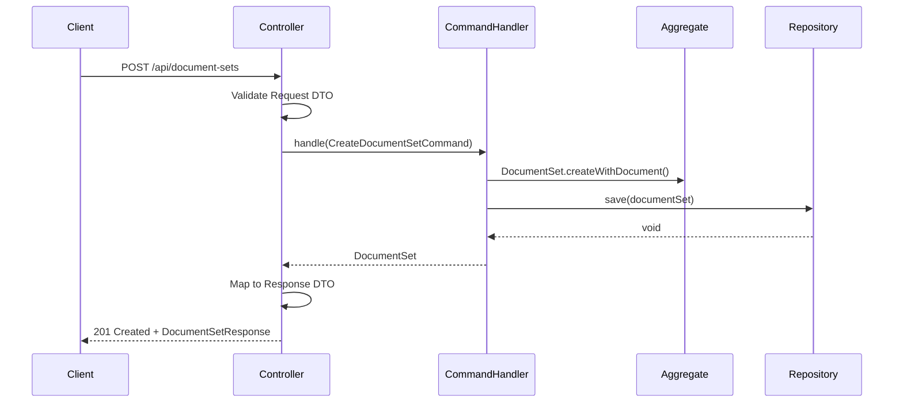

# Design Document: Documents API

## Overview

This design describes the REST API layer for the Documents domain module and the Spring Boot application module that orchestrates all domain modules. The API follows RESTful conventions with resource-oriented URLs, standard HTTP methods, and consistent error handling.

The design adheres to the hexagonal architecture pattern where controllers live within the domain module (not in a separate API module), keeping the bounded context self-contained. The application module serves as a thin orchestration layer that wires up domain modules and provides cross-cutting concerns.

## Architecture



### Request Flow



## Components and Interfaces

### REST Controllers

#### DocumentSetController

Handles all document set, document, version, and derivative operations.

```java
@RestController
@RequestMapping("/api/document-sets")
@RequiredArgsConstructor
public class DocumentSetController {
    
    private final DocumentSetCommandHandler commandHandler;
    private final DocumentSetRepository repository;
    
    // Document Set operations
    @PostMapping
    ResponseEntity<DocumentSetResponse> createDocumentSet(@Valid @RequestBody CreateDocumentSetRequest request);
    
    @GetMapping("/{id}")
    ResponseEntity<DocumentSetResponse> getDocumentSet(@PathVariable UUID id);
    
    // Document operations
    @PostMapping("/{setId}/documents")
    ResponseEntity<DocumentResponse> addDocument(@PathVariable UUID setId, @Valid @RequestBody AddDocumentRequest request);
    
    @GetMapping("/{setId}/documents/{docId}")
    ResponseEntity<DocumentResponse> getDocument(@PathVariable UUID setId, @PathVariable UUID docId);
    
    // Version operations
    @PostMapping("/{setId}/documents/{docId}/versions")
    ResponseEntity<DocumentVersionResponse> addVersion(@PathVariable UUID setId, @PathVariable UUID docId, @Valid @RequestBody AddVersionRequest request);
    
    @GetMapping("/{setId}/documents/{docId}/versions/{versionNumber}")
    ResponseEntity<DocumentVersionResponse> getVersion(@PathVariable UUID setId, @PathVariable UUID docId, @PathVariable int versionNumber);
    
    // Derivative operations
    @PostMapping("/{setId}/documents/{docId}/derivatives")
    ResponseEntity<DerivativeResponse> createDerivative(@PathVariable UUID setId, @PathVariable UUID docId, @Valid @RequestBody CreateDerivativeRequest request);
    
    @GetMapping("/{setId}/documents/{docId}/derivatives")
    ResponseEntity<List<DerivativeResponse>> getDerivatives(@PathVariable UUID setId, @PathVariable UUID docId);
    
    // Validation
    @PostMapping("/{setId}/documents/{docId}/versions/{versionNumber}/validate")
    ResponseEntity<ValidationResultResponse> validateDocument(@PathVariable UUID setId, @PathVariable UUID docId, @PathVariable int versionNumber);
}
```

#### SchemaController

Handles schema and schema version operations.

```java
@RestController
@RequestMapping("/api/schemas")
@RequiredArgsConstructor
public class SchemaController {
    
    private final SchemaCommandHandler commandHandler;
    private final SchemaRepository repository;
    
    @PostMapping
    ResponseEntity<SchemaResponse> createSchema(@Valid @RequestBody CreateSchemaRequest request);
    
    @GetMapping("/{id}")
    ResponseEntity<SchemaResponse> getSchema(@PathVariable UUID id);
    
    @PostMapping("/{schemaId}/versions")
    ResponseEntity<SchemaVersionResponse> addVersion(@PathVariable UUID schemaId, @Valid @RequestBody AddSchemaVersionRequest request);
    
    @GetMapping("/{schemaId}/versions/{versionId}")
    ResponseEntity<SchemaVersionResponse> getVersion(@PathVariable UUID schemaId, @PathVariable String versionId);
}
```

#### DocumentExceptionHandler

Maps domain exceptions to HTTP responses using @ControllerAdvice.

```java
@ControllerAdvice(assignableTypes = {DocumentSetController.class, SchemaController.class})
public class DocumentExceptionHandler {
    
    @ExceptionHandler(DocumentSetNotFoundException.class)
    ResponseEntity<ErrorResponse> handleDocumentSetNotFound(DocumentSetNotFoundException ex);
    
    @ExceptionHandler(DocumentNotFoundException.class)
    ResponseEntity<ErrorResponse> handleDocumentNotFound(DocumentNotFoundException ex);
    
    @ExceptionHandler(VersionNotFoundException.class)
    ResponseEntity<ErrorResponse> handleVersionNotFound(VersionNotFoundException ex);
    
    @ExceptionHandler(SchemaNotFoundException.class)
    ResponseEntity<ErrorResponse> handleSchemaNotFound(SchemaNotFoundException ex);
    
    @ExceptionHandler(SchemaVersionNotFoundException.class)
    ResponseEntity<ErrorResponse> handleSchemaVersionNotFound(SchemaVersionNotFoundException ex);
    
    @ExceptionHandler(DuplicateDerivativeException.class)
    ResponseEntity<ErrorResponse> handleDuplicateDerivative(DuplicateDerivativeException ex);
    
    @ExceptionHandler(SchemaInUseException.class)
    ResponseEntity<ErrorResponse> handleSchemaInUse(SchemaInUseException ex);
    
    @ExceptionHandler(UnsupportedFormatException.class)
    ResponseEntity<ErrorResponse> handleUnsupportedFormat(UnsupportedFormatException ex);
    
    @ExceptionHandler(InvalidVersionSequenceException.class)
    ResponseEntity<ErrorResponse> handleInvalidVersionSequence(InvalidVersionSequenceException ex);
    
    @ExceptionHandler(ContentHashMismatchException.class)
    ResponseEntity<ErrorResponse> handleContentHashMismatch(ContentHashMismatchException ex);
    
    @ExceptionHandler(MethodArgumentNotValidException.class)
    ResponseEntity<ErrorResponse> handleValidationErrors(MethodArgumentNotValidException ex);
}
```

### Request DTOs

All request DTOs use Java records with Jakarta validation annotations.

```java
public record CreateDocumentSetRequest(
    @NotNull DocumentType documentType,
    @NotNull UUID schemaId,
    @NotBlank String schemaVersion,
    @NotBlank String content,  // Base64 encoded
    @NotBlank String createdBy,
    Map<String, String> metadata
) {}

public record AddDocumentRequest(
    @NotNull DocumentType documentType,
    @NotNull UUID schemaId,
    @NotBlank String schemaVersion,
    @NotBlank String content,  // Base64 encoded
    @NotBlank String createdBy,
    UUID relatedDocumentId  // Optional
) {}

public record AddVersionRequest(
    @NotBlank String content,  // Base64 encoded
    @NotBlank String createdBy
) {}

public record CreateDerivativeRequest(
    @Min(1) int sourceVersionNumber,
    @NotNull Format targetFormat
) {}

public record CreateSchemaRequest(
    @NotBlank String name,
    @NotNull SchemaFormat format
) {}

public record AddSchemaVersionRequest(
    @NotBlank String versionIdentifier,
    @NotBlank String definition  // Base64 encoded
) {}
```

### Response DTOs

Response DTOs map domain objects to API representations.

```java
public record DocumentSetResponse(
    UUID id,
    Instant createdAt,
    String createdBy,
    Map<String, String> metadata,
    List<DocumentSummary> documents
) {
    public record DocumentSummary(
        UUID id,
        DocumentType type,
        int versionCount
    ) {}
}

public record DocumentResponse(
    UUID id,
    DocumentType type,
    SchemaRefResponse schemaRef,
    int versionCount,
    DocumentVersionResponse currentVersion,
    List<DerivativeResponse> derivatives
) {}

public record DocumentVersionResponse(
    UUID id,
    int versionNumber,
    String contentHash,
    Instant createdAt,
    String createdBy
) {}

public record DerivativeResponse(
    UUID id,
    UUID sourceVersionId,
    Format targetFormat,
    String contentHash,
    String transformationMethod,
    Instant createdAt
) {}

public record SchemaResponse(
    UUID id,
    String name,
    SchemaFormat format,
    List<SchemaVersionSummary> versions
) {
    public record SchemaVersionSummary(
        UUID id,
        String versionIdentifier,
        Instant createdAt,
        boolean deprecated
    ) {}
}

public record SchemaVersionResponse(
    UUID id,
    String versionIdentifier,
    Instant createdAt,
    boolean deprecated
) {}

public record SchemaRefResponse(
    UUID schemaId,
    String version
) {}

public record ValidationResultResponse(
    boolean valid,
    List<ValidationErrorResponse> errors,
    List<ValidationWarningResponse> warnings
) {
    public record ValidationErrorResponse(String path, String message) {}
    public record ValidationWarningResponse(String path, String message) {}
}

public record ErrorResponse(
    String code,
    String message,
    Instant timestamp,
    Map<String, Object> details
) {
    public static ErrorResponse of(String code, String message) {
        return new ErrorResponse(code, message, Instant.now(), Map.of());
    }
    
    public static ErrorResponse of(String code, String message, Map<String, Object> details) {
        return new ErrorResponse(code, message, Instant.now(), details);
    }
}
```

### Application Module

#### Application Entry Point

```java
@SpringBootApplication
@ComponentScan(basePackages = {
    "com.example.documents",
    "com.example.application"
})
public class Application {
    public static void main(String[] args) {
        SpringApplication.run(Application.class, args);
    }
}
```

#### Global Configuration

```java
@Configuration
public class WebConfig implements WebMvcConfigurer {
    
    @Override
    public void addCorsMappings(CorsRegistry registry) {
        registry.addMapping("/api/**")
            .allowedOrigins("*")
            .allowedMethods("GET", "POST", "PUT", "DELETE", "OPTIONS")
            .allowedHeaders("*");
    }
}
```

#### Global Exception Handler

```java
@ControllerAdvice
@Order(Ordered.LOWEST_PRECEDENCE)
public class GlobalExceptionHandler {
    
    @ExceptionHandler(Exception.class)
    ResponseEntity<ErrorResponse> handleUnexpectedError(Exception ex) {
        return ResponseEntity.status(HttpStatus.INTERNAL_SERVER_ERROR)
            .body(ErrorResponse.of("INTERNAL_ERROR", "An unexpected error occurred"));
    }
}
```

## Data Models

### HTTP Status Code Mapping

| Exception | HTTP Status | Error Code |
|-----------|-------------|------------|
| DocumentSetNotFoundException | 404 | DOCUMENT_SET_NOT_FOUND |
| DocumentNotFoundException | 404 | DOCUMENT_NOT_FOUND |
| VersionNotFoundException | 404 | VERSION_NOT_FOUND |
| SchemaNotFoundException | 404 | SCHEMA_NOT_FOUND |
| SchemaVersionNotFoundException | 404 | SCHEMA_VERSION_NOT_FOUND |
| DuplicateDerivativeException | 409 | DUPLICATE_DERIVATIVE |
| SchemaInUseException | 409 | SCHEMA_IN_USE |
| UnsupportedFormatException | 400 | UNSUPPORTED_FORMAT |
| InvalidVersionSequenceException | 400 | INVALID_VERSION_SEQUENCE |
| ContentHashMismatchException | 400 | CONTENT_HASH_MISMATCH |
| MethodArgumentNotValidException | 400 | VALIDATION_ERROR |
| IllegalArgumentException | 400 | BAD_REQUEST |

### Content Encoding

Document and schema content is transmitted as Base64-encoded strings in request/response bodies. The controllers handle encoding/decoding:

```java
// Decoding in controller
byte[] contentBytes = Base64.getDecoder().decode(request.content());
Content content = Content.of(contentBytes, determineFormat(request));

// Encoding in response (if needed for content retrieval endpoints)
String encodedContent = Base64.getEncoder().encodeToString(contentBytes);
```

### API Endpoints Summary

| Method | Endpoint | Description |
|--------|----------|-------------|
| POST | /api/document-sets | Create document set with initial document |
| GET | /api/document-sets/{id} | Get document set by ID |
| POST | /api/document-sets/{setId}/documents | Add document to set |
| GET | /api/document-sets/{setId}/documents/{docId} | Get document by ID |
| POST | /api/document-sets/{setId}/documents/{docId}/versions | Add version to document |
| GET | /api/document-sets/{setId}/documents/{docId}/versions/{num} | Get version by number |
| POST | /api/document-sets/{setId}/documents/{docId}/derivatives | Create derivative |
| GET | /api/document-sets/{setId}/documents/{docId}/derivatives | List derivatives |
| POST | /api/document-sets/{setId}/documents/{docId}/versions/{num}/validate | Validate document |
| POST | /api/schemas | Create schema |
| GET | /api/schemas/{id} | Get schema by ID |
| POST | /api/schemas/{schemaId}/versions | Add schema version |
| GET | /api/schemas/{schemaId}/versions/{versionId} | Get schema version |


## Correctness Properties

*A property is a characteristic or behavior that should hold true across all valid executions of a system—essentially, a formal statement about what the system should do. Properties serve as the bridge between human-readable specifications and machine-verifiable correctness guarantees.*

Based on the prework analysis, the following properties have been identified and consolidated to eliminate redundancy:

### Property 1: Valid Create Requests Return 201 Created

*For any* valid create request (document set, document, version, derivative, schema, or schema version), the API SHALL return HTTP 201 Created with a response body containing the created resource's ID.

**Validates: Requirements 1.1, 2.1, 3.1, 4.1, 6.1, 7.1**

### Property 2: Create-Retrieve Round Trip

*For any* resource created via POST request, a subsequent GET request for that resource SHALL return data equivalent to what was created (ID matches, required fields present, values correspond to input).

**Validates: Requirements 1.3, 2.4, 3.3, 6.3, 7.4**

### Property 3: Response Structure Completeness

*For any* successful API response, the response body SHALL contain all required fields as specified in the Response DTO definitions (no null values for required fields, correct types).

**Validates: Requirements 1.5, 2.6, 3.5, 4.5, 5.5, 6.5, 7.5**

### Property 4: Missing Required Fields Return 400

*For any* create request with one or more missing required fields, the API SHALL return HTTP 400 Bad Request with an error response containing field-level validation details.

**Validates: Requirements 1.2, 6.2, 9.1, 9.2, 9.3, 9.4, 9.5, 9.6, 9.7**

### Property 5: Duplicate Creation Returns 409 Conflict

*For any* attempt to create a resource that would violate uniqueness constraints (duplicate derivative for same source version and format, duplicate schema version identifier), the API SHALL return HTTP 409 Conflict.

**Validates: Requirements 4.3, 7.3**

### Property 6: Exception to HTTP Status Mapping

*For any* domain exception thrown during request processing, the Exception Handler SHALL map it to the correct HTTP status code as defined in the status code mapping table.

**Validates: Requirements 8.1, 8.2, 8.3, 8.4, 8.5, 8.6, 8.7, 8.8, 8.9, 8.10, 8.11, 8.12**

### Property 7: Error Response Structure

*For any* error response, the response body SHALL contain error code, message, and timestamp fields with non-null values.

**Validates: Requirements 8.12**

### Property 8: Derivative Listing Completeness

*For any* document with derivatives, a GET request to the derivatives endpoint SHALL return all derivatives associated with that document.

**Validates: Requirements 4.4**

## Error Handling

### Exception Handling Strategy

The API uses a layered exception handling approach:

1. **Domain-specific Exception Handler** (`DocumentExceptionHandler`): Handles exceptions specific to the documents domain, providing detailed error responses with domain context.

2. **Global Exception Handler** (`GlobalExceptionHandler`): Catches any unhandled exceptions as a fallback, returning a generic 500 Internal Server Error.

### Error Response Format

All error responses follow a consistent structure:

```json
{
  "code": "DOCUMENT_NOT_FOUND",
  "message": "Document abc123 not found in DocumentSet xyz789",
  "timestamp": "2024-01-15T10:30:00Z",
  "details": {
    "documentSetId": "xyz789",
    "documentId": "abc123"
  }
}
```

### Validation Error Format

For request validation errors (400 Bad Request), the details map contains field-level errors:

```json
{
  "code": "VALIDATION_ERROR",
  "message": "Request validation failed",
  "timestamp": "2024-01-15T10:30:00Z",
  "details": {
    "fieldErrors": [
      {"field": "documentType", "message": "must not be null"},
      {"field": "content", "message": "must not be blank"}
    ]
  }
}
```

### Exception Handler Implementation

```java
@ControllerAdvice(assignableTypes = {DocumentSetController.class, SchemaController.class})
@Slf4j
public class DocumentExceptionHandler {

    @ExceptionHandler(DocumentSetNotFoundException.class)
    public ResponseEntity<ErrorResponse> handleDocumentSetNotFound(DocumentSetNotFoundException ex) {
        log.debug("Document set not found: {}", ex.documentSetId());
        return ResponseEntity.status(HttpStatus.NOT_FOUND)
            .body(ErrorResponse.of("DOCUMENT_SET_NOT_FOUND", ex.getMessage(),
                Map.of("documentSetId", ex.documentSetId().toString())));
    }

    @ExceptionHandler(MethodArgumentNotValidException.class)
    public ResponseEntity<ErrorResponse> handleValidationErrors(MethodArgumentNotValidException ex) {
        List<Map<String, String>> fieldErrors = ex.getBindingResult().getFieldErrors().stream()
            .map(error -> Map.of(
                "field", error.getField(),
                "message", error.getDefaultMessage()))
            .toList();
        
        return ResponseEntity.status(HttpStatus.BAD_REQUEST)
            .body(ErrorResponse.of("VALIDATION_ERROR", "Request validation failed",
                Map.of("fieldErrors", fieldErrors)));
    }
    
    // Additional handlers follow the same pattern...
}
```

## Testing Strategy

### Dual Testing Approach

The API layer requires both unit tests and integration tests:

1. **Unit Tests**: Test individual components in isolation
   - Controller method logic (request mapping, response building)
   - Exception handler mappings
   - DTO validation constraints
   - Response mapping logic

2. **Integration Tests**: Test the full request/response cycle
   - HTTP endpoint accessibility
   - Request validation
   - Exception handling through the full stack
   - Response serialisation

### Property-Based Testing

Property-based tests will be implemented using jqwik to verify the correctness properties defined above. Each property test will:
- Run a minimum of 100 iterations
- Generate random valid/invalid inputs as appropriate
- Verify the property holds for all generated inputs

**Test Configuration**:
- Framework: jqwik 1.8.2
- Minimum iterations: 100 per property
- Each test tagged with: `Feature: documents-api, Property {number}: {property_text}`

### Unit Test Focus Areas

| Component | Test Focus |
|-----------|------------|
| DocumentSetController | Request mapping, command construction, response mapping |
| SchemaController | Request mapping, command construction, response mapping |
| DocumentExceptionHandler | Exception to HTTP status mapping, error response structure |
| Request DTOs | Validation constraint enforcement |
| Response DTOs | Correct mapping from domain objects |

### Integration Test Focus Areas

| Endpoint | Test Scenarios |
|----------|----------------|
| POST /api/document-sets | Valid creation, validation errors, schema not found |
| GET /api/document-sets/{id} | Found, not found |
| POST /api/document-sets/{setId}/documents | Valid addition, set not found, schema not found |
| POST /api/schemas | Valid creation, validation errors |
| POST /api/schemas/{id}/versions | Valid addition, schema not found, duplicate version |

### Test Data Generation

For property-based tests, generators will be created for:
- Valid request DTOs with random but valid field values
- Invalid request DTOs with specific fields nulled or blanked
- Domain objects for response mapping tests

### Mocking Strategy

- **Unit Tests**: Mock command handlers and repositories
- **Integration Tests**: Use in-memory implementations or test containers for DynamoDB
