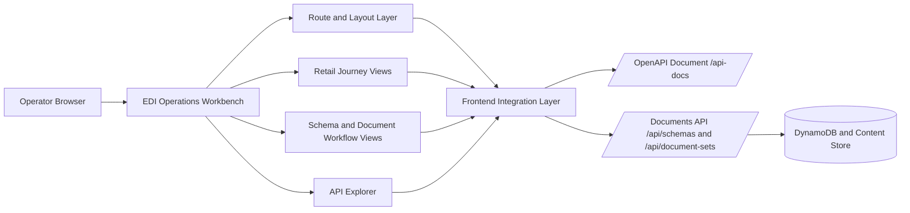
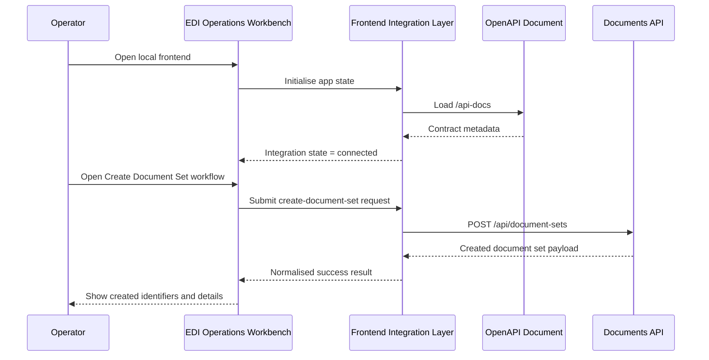

## Overview

The first frontend will be implemented as a standalone web application inside the repository, using TypeScript, React, and `shadcn/ui` to create a retail-oriented operations workbench on top of the existing Spring Boot Documents API. The design deliberately favours a workflow-first experience over a generic endpoint console: operators should start from purchase order, shipment, receipt, and invoice journeys, then drill into the actual schema, document-set, version, derivative, and validation operations already exposed by the backend.

The design is informed by a short exploration of what makes a good EDI platform usable in practice. The strongest themes are operational clarity, inspectable payload history, guided task flows, visible system health, and low-friction access to the underlying contract. Those themes lead directly to four decisions: keep the backend connection state visible at all times, expose payload and validation evidence as first-class UI elements, use the live OpenAPI document as the source of truth for endpoint discovery, and mark future workflow steps as planned when the current backend does not yet support them.

## Architecture

The frontend is a separate application-plane delivery surface that consumes the existing local application plane API. It does not replace Swagger. Instead, it adds a richer operator shell and uses the OpenAPI document both as runtime metadata for an API explorer and as the input to a generated typed client for workflow views.





The local wiring strategy has two parts:

1. Runtime contract discovery for connection state and API explorer content.
2. Dev-time typed client generation from the same local OpenAPI document so workflow views stay aligned with real endpoints.

This split keeps the workbench stable even when the backend evolves. The explorer always reflects the live contract, while typed workflow code remains maintainable and strongly aligned with the current API surface.

## Components and Interfaces

### 1. Frontend application shell

- Provides the persistent layout, navigation, page header, connection badge, retry controls, and route-level error boundaries.
- Owns the top-level states `loading-contract`, `connected`, `contract-failed`, and `degraded-request-failure`.

Interface:

- Input: current route, integration state, selected tenant or environment settings when introduced later.
- Output: rendered layout and page composition.

### 2. Retail journey views

- Present curated journey cards for `ORDERS`, `DESADV`, `RECADV`, and `INVOIC`.
- Translate current backend capabilities into executable and planned steps.
- Use existing document types such as `ORDER`, `DESPATCH_ADVICE`, `RECEIPT_ADVICE`, `INVOICE`, and `REMITTANCE_ADVICE` to show journey evidence.

Interface:

- Input: document-set summaries, document details, workflow capability map.
- Output: journey timeline, recommended actions, linked records.

### 3. Schema workflow views

- Provide forms and detail pages for schema creation and version management.
- Encode base64 payload preparation for schema definitions at the UI edge while leaving backend validation authoritative.

Interface:

- Input: schema form values, schema detail data, create and add-version results.
- Output: submission requests, success summaries, recoverable validation failures.

### 4. Document workflow views

- Provide list, create, add-document, add-version, derivative, validation, and content-download screens.
- Keep pagination tokens opaque to the user and expose only next and previous style controls.

Interface:

- Input: paginated document-set data, document-set details, form values.
- Output: workflow requests, detail projections, download actions.

### 5. API explorer

- Uses the runtime OpenAPI document to list operations, summaries, methods, paths, and visible request or response schema information.
- Complements, rather than duplicates, the guided workflow views.

Interface:

- Input: OpenAPI document.
- Output: browsable operation catalogue and operation detail panels.

### 6. Frontend integration layer

- Encapsulates backend URL resolution, OpenAPI loading, typed API calls, request state handling, and response normalisation.
- Uses a generated API client for known workflow calls and a lightweight runtime parser for explorer metadata.

Interface:

- `loadContract(baseUrl): Promise<ContractState>`
- `listDocumentSets(limit, nextToken): Promise<PaginatedDocumentSetSummary>`
- `createDocumentSet(command): Promise<DocumentSetViewModel>`
- `getDocumentSet(id): Promise<DocumentSetViewModel>`
- `createSchema(command): Promise<SchemaViewModel>`
- `addSchemaVersion(command): Promise<SchemaVersionViewModel>`
- `executeValidation(command): Promise<ValidationResultViewModel>`
- `downloadContent(documentVersionRef): Promise<DownloadDescriptor>`

### 7. Backend contracts relied on initially

- `GET /api-docs`
- `GET|POST /api/schemas`
- `GET /api/schemas/{id}`
- `POST /api/schemas/{schemaId}/versions`
- `GET /api/schemas/{schemaId}/versions/{versionId}`
- `GET|POST /api/document-sets`
- `GET /api/document-sets/{id}`
- `POST /api/document-sets/{setId}/documents`
- `GET /api/document-sets/{setId}/documents/{docId}`
- `POST /api/document-sets/{setId}/documents/{docId}/versions`
- `GET /api/document-sets/{setId}/documents/{docId}/versions/{versionNumber}`
- `GET /api/document-sets/{setId}/documents/{docId}/versions/{versionNumber}/content`
- `POST /api/document-sets/{setId}/documents/{docId}/derivatives`
- `GET /api/document-sets/{setId}/documents/{docId}/derivatives`
- `POST /api/document-sets/{setId}/documents/{docId}/versions/{versionNumber}/validate`

## Data Models

The frontend data model should stay intentionally close to the backend contract and introduce only small view-model projections.

### Core frontend types

```ts
type IntegrationState =
  | { kind: 'loading-contract' }
  | { kind: 'connected'; baseUrl: string; contractTitle: string; contractVersion: string }
  | { kind: 'contract-failed'; baseUrl: string; reason: string }
  | { kind: 'request-failed'; baseUrl: string; operationId: string; reason: string }

type RetailJourneyKey = 'orders' | 'desadv' | 'recadv' | 'invoic'

type JourneyStepState = 'available' | 'planned' | 'empty'

type JourneyStep = {
  key: string
  label: string
  documentType?: string
  state: JourneyStepState
  linkedRecordCount: number
  actionPath?: string
}

type JourneyViewModel = {
  key: RetailJourneyKey
  title: string
  summary: string
  steps: JourneyStep[]
}

type ApiOperationSummary = {
  operationId: string
  method: string
  path: string
  summary: string
  tag?: string
}

type PaginatedDocumentSetSummary = {
  items: DocumentSetViewModel[]
  nextToken?: string
  nextUrl?: string
}
```

### Form models

- `CreateSchemaFormModel`: `name`, `format`
- `AddSchemaVersionFormModel`: `schemaId`, `versionIdentifier`, `definitionText`
- `CreateDocumentSetFormModel`: `documentType`, `schemaId`, `schemaVersion`, `contentText`, `createdBy`, `metadata`
- `AddDocumentFormModel`: `setId`, `documentType`, `schemaId`, `schemaVersion`, `contentText`, `createdBy`, `relatedDocumentId`
- `AddVersionFormModel`: `setId`, `documentId`, `contentText`, `createdBy`

Each form model uses raw text for operator input and transforms to base64 payload strings only at submission time. This keeps user-visible state inspectable and simplifies retry behaviour.

### Local configuration model

```ts
type LocalBackendConfig = {
  defaultBaseUrl: 'http://localhost:8080'
  openApiPath: '/api-docs'
  overrideEnvVarName: 'VITE_API_BASE_URL'
}
```

## Correctness Properties

*A property is a characteristic or behavior that should hold true across all valid executions of a system — essentially, a formal statement about what the system should do. Properties serve as the bridge between human-readable specifications and machine-verifiable correctness guarantees.*

### Prework Analysis

#### EDI operations workbench

W1.1 Persistent navigation for dashboard, schemas, document sets, retail journeys, and API explorer.
  Thoughts: This is a route-to-layout mapping rule. It can be tested by generating valid route keys and asserting all primary destinations render in the shell model.
  Testable: yes - property

W1.2 Opening the workbench shows current backend connection state.
  Thoughts: This is a deterministic state projection from integration state to shell badge.
  Testable: yes - property

W1.3 Navigation preserves header, action area, and status region.
  Thoughts: This is a shell invariant across route changes.
  Testable: yes - property

W1.4 Initial application state load failure shows error state with retry.
  Thoughts: This is a specific failure-state projection.
  Testable: yes - example

W2.1 Present Retail_Journeys for purchase order, despatch advice, receipt advice, and invoice handling.
  Thoughts: This is a catalogue completeness rule across configured journeys.
  Testable: yes - property

W2.2 Opening a Retail_Journey shows related document types, recommended next actions, and linked records.
  Thoughts: This is a view-model projection rule from journey configuration plus backend data.
  Testable: yes - property

W2.3 Empty Retail_Journey explains which records can populate the Retail_Journey.
  Thoughts: This is an empty-state branch.
  Testable: yes - example

W2.4 Unsupported backend steps are marked planned rather than executable.
  Thoughts: This is a capability-map projection and is suitable for generated support matrices.
  Testable: yes - property

W3.1 Workflow_View for creating a schema and adding a schema version.
  Thoughts: This is presence of routes and screens. Best treated as example tests around routing.
  Testable: yes - example

W3.2 Required schema fields are validated before submission.
  Thoughts: This is input validation over many invalid combinations.
  Testable: yes - property

W3.3 Successful schema responses display returned identifiers and version metadata.
  Thoughts: This is response-to-view projection.
  Testable: yes - property

W3.4 Failed schema operations display backend errors without losing entered values.
  Thoughts: This is an error-handling invariant over arbitrary form state.
  Testable: yes - property

W4.1 Workflow_Views exist for list, create, add-document, add-version, and derivative flows.
  Thoughts: This is route and screen presence.
  Testable: yes - example

W4.2 Paginated results expose continuation navigation using backend pagination data.
  Thoughts: This is a pagination mapping rule across many page payloads.
  Testable: yes - property

W4.3 Opening a document set displays documents, current versions, derivatives, and schema references.
  Thoughts: This is a projection completeness invariant for any document-set payload.
  Testable: yes - property

W4.4 Invalid or incomplete document content is blocked locally or reported from backend.
  Thoughts: This is validation and error propagation over bad inputs. Good property target with edge cases.
  Testable: yes - property

W5.1 Version detail view shows version metadata, validation status, and actions.
  Thoughts: This is another projection completeness rule.
  Testable: yes - property

W5.2 Validation requests display returned validation outcome including pass or fail status and message details.
  Thoughts: Deterministic mapping from backend response to displayed state.
  Testable: yes - property

W5.3 Raw content request provides browser-initiated download using backend content.
  Thoughts: This is a download descriptor mapping from response headers and bytes.
  Testable: yes - property

W5.4 Missing raw content shows recoverable error identifying affected document version.
  Thoughts: Specific error branch.
  Testable: yes - example

#### Local OpenAPI API integration

I1.1 Integration layer targets Local_Backend using repository-supported local defaults.
  Thoughts: This is base URL resolution logic with finite inputs.
  Testable: yes - property

I1.2 Local startup attempts to load the OpenAPI_Document.
  Thoughts: This is startup state machine behaviour.
  Testable: yes - example

I1.3 OpenAPI load failure surfaces expected backend location.
  Thoughts: Error-state projection with base URL preservation.
  Testable: yes - property

I1.4 Override location is used for discovery and requests.
  Thoughts: This is precedence logic over default and override inputs.
  Testable: yes - property

I2.1 Available OpenAPI_Document lists backend operations in API_Explorer.
  Thoughts: This is parser and projection behaviour over many operation sets.
  Testable: yes - property

I2.2 Opening an operation shows path, method, summary, and request or response schema metadata.
  Thoughts: Projection completeness over arbitrary operation shapes.
  Testable: yes - property

I2.3 Explorer indicates catalogue is sourced from live OpenAPI_Document while backend is reachable.
  Thoughts: This is connection-state rendering.
  Testable: yes - property

I2.4 Changed OpenAPI_Document is reflected in the next loaded session.
  Thoughts: This is a session reload idempotence and replacement rule.
  Testable: yes - property

I3.1 Integration layer sources workflow data from Documents_API.
  Thoughts: This is architectural intent and difficult to prove purely behaviourally without implementation coupling.
  Testable: no

I3.2 Successful workflow action returns backend response payload to initiating view.
  Thoughts: Deterministic response propagation.
  Testable: yes - property

I3.3 Error response exposes returned status and message details to initiating view.
  Thoughts: Deterministic error propagation.
  Testable: yes - property

I3.4 Unreachable backend prevents live submission and presents retry path.
  Thoughts: Specific failure branch plus state-machine transition.
  Testable: yes - example

I4.1 Workbench shows contract load pending, successful, or failed.
  Thoughts: Finite state projection across all contract states.
  Testable: yes - property

I4.2 Backend-dependent views show request lifecycle state.
  Thoughts: View-state mapping over pending, success, and failure.
  Testable: yes - property

I4.3 Request failure after successful contract load identifies failed operation and provides retry.
  Thoughts: Error-state projection with retained operation identifier.
  Testable: yes - property

I4.4 Backend recovery allows refresh without full page reload.
  Thoughts: Recovery transition in integration state machine.
  Testable: yes - property

### Property Reflection

Several criteria collapse into stronger shared properties:

- W1.1, W1.2, W1.3, I4.1, and I4.2 all describe shell and state projection, so they can be combined into one shell-state property.
- W2.1, W2.2, and W2.4 all describe journey projection from capability and document data, so they belong in one journey-mapping property.
- W3.2, W3.3, and W3.4 all describe schema workflow form behaviour and response propagation, so they can be combined into one schema-workflow property.
- W4.2, W4.3, W4.4, W5.1, and W5.2 all concern document workflow projection and error propagation, so they can be covered by one document-workflow property plus one pagination-specific property.
- I1.1, I1.3, and I1.4 all describe backend URL resolution, so they become one configuration-resolution property.
- I2.1, I2.2, I2.3, and I2.4 all describe OpenAPI projection, so they become one contract-explorer property.
- I3.2, I3.3, I4.3, and I4.4 describe request lifecycle and recovery, so they become one request-state-machine property.
- W5.3 remains distinct because download descriptor correctness is unique.

### Property 1: Shell state projection remains consistent across routes

*For any* valid primary route and any integration state, the shell should render the same primary navigation destinations and should project the current integration state into a visible status region without removing the shared header and action regions.

**Validates: Requirements W1.1, W1.2, W1.3, I4.1, I4.2**

### Property 2: Retail journey mapping reflects supported and planned steps

*For any* retail journey definition, supported-capability map, and linked backend record set, the journey view should include the configured journey, should label supported steps as available, should label unsupported steps as planned, and should preserve the linked record counts for each step.

**Validates: Requirements W2.1, W2.2, W2.4**

### Property 3: Schema workflow validation and recovery preserve user intent

*For any* schema or schema-version form state and any successful or failed backend response, submitting invalid required-field combinations should be rejected before request dispatch, successful responses should preserve returned identifiers and version metadata, and failed responses should retain the entered form values while exposing backend error details.

**Validates: Requirements W3.2, W3.3, W3.4**

### Property 4: Document workflow projection preserves document evidence

*For any* document-set detail payload, validation response, and submission result, the document workflow views should preserve document membership, current-version information, derivative information, schema references, validation outcome details, and actionable error information in the rendered view model.

**Validates: Requirements W4.3, W4.4, W5.1, W5.2**

### Property 5: Pagination tokens are preserved as opaque continuation state

*For any* paginated document-set response carrying items and optional continuation data, the pagination view model should preserve item ordering, expose the returned continuation token only through continuation controls, and reproduce the returned `nextToken` and `nextUrl` values without semantic reinterpretation.

**Validates: Requirements W4.2**

### Property 6: Download descriptors preserve backend content identity

*For any* successful raw-content response carrying bytes, media type, file name metadata, and document version identity, the generated download descriptor should preserve the same bytes and identify the same document version for the initiated download.

**Validates: Requirements W5.3**

### Property 7: Local backend configuration resolution is deterministic

*For any* combination of default local configuration and optional override configuration, the resolved backend base URL should equal the override when an override is present and should equal the repository-supported local default otherwise, and any contract-load failure state should preserve the resolved backend location.

**Validates: Requirements I1.1, I1.3, I1.4**

### Property 8: OpenAPI explorer projection is contract-complete

*For any* OpenAPI document containing operation identifiers, methods, paths, summaries, tags, and request or response schema metadata, the API explorer projection should include every operation exactly once and should preserve the operation metadata required for list and detail views.

**Validates: Requirements I2.1, I2.2, I2.3, I2.4**

### Property 9: Request lifecycle transitions are recoverable

*For any* successful contract state and any backend request outcome, the integration state machine should move backend-dependent views through pending, success, or failed states, should preserve the failed operation identifier on failure, and should allow a retry or refresh transition back to a pending or connected state without full browser restart.

**Validates: Requirements I3.2, I3.3, I4.3, I4.4**

## Error Handling

Failure handling is intentionally explicit because the frontend is meant to expose operational state, not hide it.

### Failure modes

- Contract discovery failure: `/api-docs` is unreachable, malformed, or returns a non-success response.
- Request execution failure: workflow API call fails after a successful contract load.
- Validation failure: backend rejects schema or document payloads.
- Download failure: raw content endpoint returns an error or missing payload.
- Unsupported capability: retail journey step has no executable backend mapping yet.

### Recovery strategy

- Contract discovery failure moves the shell into `contract-failed` and keeps the expected backend base URL visible.
- Request execution failure moves the active view into `request-failed` while preserving the previous route and entered form state.
- Validation failure is shown inline in the initiating workflow view.
- Unsupported capability is rendered as `planned`, never as a broken action.
- Recovery is user-driven through retry and refresh actions so the system stays predictable.

### Error codes and surface shape

The frontend should normalise backend and local integration failures into a small internal shape:

```ts
type FrontendError = {
  kind: 'contract-load' | 'request' | 'validation' | 'download' | 'unsupported-capability'
  operationId?: string
  backendStatus?: number
  message: string
  retryable: boolean
}
```

This keeps error handling composable while still allowing exact backend messages to be shown to operators when available.

## Testing Strategy

**Framework:** `vitest` for unit and component-level tests, `fast-check` for property-based tests, and React Testing Library for rendered behaviour.

**Test location:** `frontend/.../src/**/*.test.ts(x)` for unit and component tests, with property-based tests co-located beside the state and mapping modules they validate.

**Unit tests:**

- Shell renders required top-level routes and retry affordances.
- Empty retail journeys explain missing records.
- Schema and document workflow routes mount the expected forms.
- Initial contract failure and missing raw-content failures render recoverable error states.
- Unreachable backend blocks live submissions and exposes retry controls.

**Property-based tests:**

For each correctness property:

- Property 1: Shell state projection remains consistent across routes
  - Generator strategy: generate valid route keys and all integration-state variants.
  - Edge cases to include in generators: `contract-failed`, `request-failed`, and routes with no data loaded yet.
  - Tag: `Feature: edi-operations-workbench, Property 1: Shell state projection remains consistent across routes`
  - Minimum iterations: 100

- Property 2: Retail journey mapping reflects supported and planned steps
  - Generator strategy: generate journey definitions, capability matrices, and linked record counts for each step.
  - Edge cases to include in generators: journeys with zero linked records and journeys where every step is planned.
  - Tag: `Feature: edi-operations-workbench, Property 2: Retail journey mapping reflects supported and planned steps`
  - Minimum iterations: 100

- Property 3: Schema workflow validation and recovery preserve user intent
  - Generator strategy: generate valid and invalid schema form combinations plus successful and failed backend responses.
  - Edge cases to include in generators: blank names, missing formats, empty version identifiers, and long definition text.
  - Tag: `Feature: edi-operations-workbench, Property 3: Schema workflow validation and recovery preserve user intent`
  - Minimum iterations: 100

- Property 4: Document workflow projection preserves document evidence
  - Generator strategy: generate nested document-set payloads with documents, versions, derivatives, schema references, and validation responses.
  - Edge cases to include in generators: empty derivative lists, failed validations, and incomplete document content submissions.
  - Tag: `Feature: edi-operations-workbench, Property 4: Document workflow projection preserves document evidence`
  - Minimum iterations: 100

- Property 5: Pagination tokens are preserved as opaque continuation state
  - Generator strategy: generate paginated payloads with item arrays and optional continuation metadata.
  - Edge cases to include in generators: missing `nextToken`, missing `nextUrl`, and single-page responses.
  - Tag: `Feature: local-openapi-api-integration, Property 5: Pagination tokens are preserved as opaque continuation state`
  - Minimum iterations: 100

- Property 6: Download descriptors preserve backend content identity
  - Generator strategy: generate file metadata, media types, document version references, and arbitrary byte arrays.
  - Edge cases to include in generators: empty byte arrays and octet-stream responses without file names.
  - Tag: `Feature: edi-operations-workbench, Property 6: Download descriptors preserve backend content identity`
  - Minimum iterations: 100

- Property 7: Local backend configuration resolution is deterministic
  - Generator strategy: generate override and non-override local configuration combinations.
  - Edge cases to include in generators: empty override strings and malformed override URLs flagged as invalid inputs.
  - Tag: `Feature: local-openapi-api-integration, Property 7: Local backend configuration resolution is deterministic`
  - Minimum iterations: 100

- Property 8: OpenAPI explorer projection is contract-complete
  - Generator strategy: generate synthetic OpenAPI operation maps with varying methods, tags, schema metadata, and summaries.
  - Edge cases to include in generators: missing tags, missing summaries, and operations with only response metadata.
  - Tag: `Feature: local-openapi-api-integration, Property 8: OpenAPI explorer projection is contract-complete`
  - Minimum iterations: 100

- Property 9: Request lifecycle transitions are recoverable
  - Generator strategy: generate request lifecycle event sequences over connected, pending, failed, retry, and recovered states.
  - Edge cases to include in generators: repeated retries, failure after success, and recovery without full reload.
  - Tag: `Feature: local-openapi-api-integration, Property 9: Request lifecycle transitions are recoverable`
  - Minimum iterations: 100

Tests should avoid mocking where possible by exercising pure state reducers, mapping functions, and form-validation functions directly. Browser-bound integration points should use lightweight request stubs only at the network boundary.
