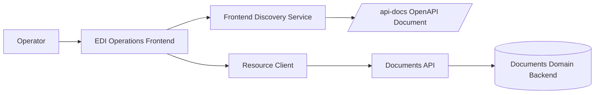
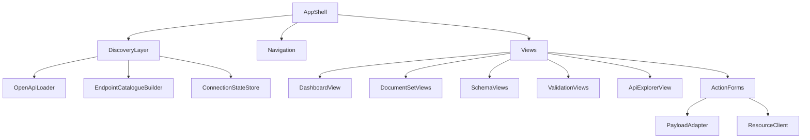
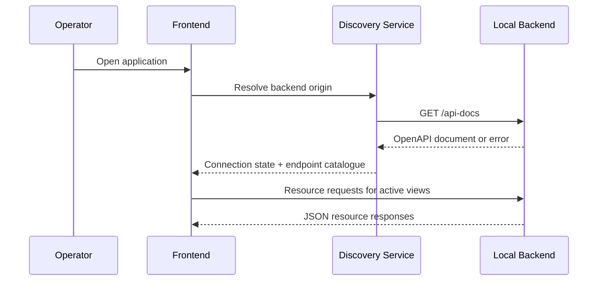

## Overview

The first frontend will be a new TypeScript React application built with `shadcn/ui` and positioned as an EDI operations console for retail and e-commerce teams. The design uses the existing Spring Boot backend as the system of record and treats `/api-docs` as the runtime discovery contract so the frontend can wire itself to the local API without hardcoded endpoint lists.

The first version deliberately separates two concerns:

1. A curated operator UX for the business workflows that matter now: browse document sets, inspect versions, manage schemas, validate content, and invoke existing write actions.
2. A runtime discovery layer that reads the local OpenAPI document, generates an endpoint catalogue, exposes connection health, and prevents the UI from advertising actions that the running backend does not support.

Exploration of the current repo and external EDI product patterns suggests that a strong first operator experience should emphasise onboarding speed, transaction visibility, validation outcomes, and exception handling. The design therefore frames the backend's generic document resources with EDI-oriented language and message-type context, while keeping backend identifiers and payloads visible for debugging.

## Architecture

The frontend will be added as a standalone application, most likely under `frontend/ops-console`, and will connect to the existing backend running on `http://localhost:8080` by default.



The frontend will use a layered structure:



Data flow for local startup:



Key architectural decisions:

- Use runtime OpenAPI discovery for availability and local autowiring.
- Use curated resource clients for existing operations instead of fully generating the whole UI from schema metadata.
- Keep request/response payload visibility at the call site in the UI so developers can debug interactions without opening Swagger.
- Start as a separate frontend process with a configurable backend origin, then allow future co-hosting behind the Spring application if desired.

## Components and Interfaces

### 1. App shell

Responsibilities:

- Render the overall page frame, navigation, connection banner, and route outlet.
- Apply the UK retail-inspired visual language through `shadcn/ui` primitives and theme tokens.
- Surface the active backend origin and connection state globally.

Primary interfaces:

- `AppRouteConfig`: declares available screens.
- `ShellState`: includes navigation state, active backend origin, and connection health.

### 2. Frontend discovery service

Responsibilities:

- Resolve the backend origin from environment config first, then from documented defaults.
- Fetch `/api-docs`.
- Parse tags, paths, methods, and request-body metadata into a frontend endpoint catalogue.
- Mark operations or groups as available, unavailable, or degraded.

Primary interfaces:

- `resolveBackendOrigin(): Promise<BackendOrigin>`
- `loadOpenApiDocument(origin): Promise<OpenApiDocumentResult>`
- `buildEndpointCatalogue(openApiDocument): EndpointCatalogue`

### 3. Resource client

Responsibilities:

- Provide typed fetch functions for the currently supported endpoints.
- Encapsulate query parameters, path construction, and JSON parsing.
- Return structured success and error results to view models.

Primary interfaces:

- `listDocumentSets(limit, nextToken)`
- `getDocumentSet(id)`
- `createDocumentSet(request)`
- `addDocument(setId, request)`
- `addVersion(setId, docId, request)`
- `validateDocument(setId, docId, versionNumber)`
- `createSchema(request)`
- `addSchemaVersion(schemaId, request)`
- `getSchema(id)`
- `getSchemaVersion(schemaId, versionId)`
- `createDerivative(setId, docId, request)`

### 4. Payload adapter

Responsibilities:

- Convert human-readable payload input into Base64-encoded API request fields.
- Preserve the original operator input for editing and error recovery.
- Expose request and response payload snapshots for UI debugging.

Primary interfaces:

- `encodePayload(rawText): EncodedPayload`
- `buildCreateDocumentSetRequest(formState): CreateDocumentSetRequest`
- `buildAddDocumentRequest(formState): AddDocumentRequest`
- `buildAddSchemaVersionRequest(formState): AddSchemaVersionRequest`

### 5. View modules

Responsibilities:

- Render business-facing screens with EDI framing over backend resources.
- Separate list, detail, and action workflows for document sets and schemas.
- Provide an API explorer screen sourced from the endpoint catalogue.

Primary screens:

- `DashboardView`
- `DocumentSetsListView`
- `DocumentSetDetailView`
- `SchemaListOrEntryView`
- `SchemaDetailView`
- `ValidationResultView`
- `ApiExplorerView`

### 6. UI state and data fetching

The frontend should use a standard React data layer such as TanStack Query so resource state, retry state, and mutation outcomes are handled consistently. Query keys will include the active backend origin to avoid cross-environment leakage during local development.

## Data Models

### Backend origin and discovery

```ts
type BackendOrigin = {
  baseUrl: string
  source: 'env' | 'default' | 'manual'
}

type ConnectionState = {
  status: 'healthy' | 'degraded' | 'unavailable'
  baseUrl: string
  openApiUrl: string
  message?: string
}
```

### OpenAPI-derived catalogue

```ts
type EndpointCatalogueGroup =
  | 'document-sets'
  | 'documents'
  | 'schemas'
  | 'derivatives'
  | 'validation'
  | 'api-reference'

type EndpointDescriptor = {
  operationId?: string
  method: 'GET' | 'POST'
  path: string
  summary: string
  tag: string
  available: boolean
  group: EndpointCatalogueGroup
}

type EndpointCatalogue = {
  sourceTitle: string
  sourceVersion: string
  groups: Record<EndpointCatalogueGroup, EndpointDescriptor[]>
}
```

### Operator-facing document framing

```ts
type SupportedMessageType =
  | 'ORDERS'
  | 'ORDRSP'
  | 'DESADV'
  | 'RECADV'
  | 'INVOIC'
  | 'REMADV'
  | 'PAYORD'
  | 'PRICAT'
  | 'INVRPT'
  | 'SLSRPT'

type MessageFraming = {
  messageType: SupportedMessageType
  displayLabel: string
  businessIntent: string
}
```

### Action workflow state

```ts
type ActionWorkflowState<TInput, TRequest, TResponse> = {
  input: TInput
  requestPreview?: TRequest
  response?: TResponse
  status: 'idle' | 'submitting' | 'success' | 'error'
  errorMessage?: string
}
```

### Request adapters

The frontend will mirror the backend DTO shapes currently visible in the Java controllers:

- `CreateDocumentSetRequest`
- `AddDocumentRequest`
- `AddVersionRequest`
- `CreateSchemaRequest`
- `AddSchemaVersionRequest`
- `CreateDerivativeRequest`

The mirrored TypeScript types should be intentionally narrow and only include fields needed by current operations.

## Correctness Properties

*A property is a characteristic or behavior that should hold true across all valid executions of a system — essentially, a formal statement about what the system should do. Properties serve as the bridge between human-readable specifications and machine-verifiable correctness guarantees.*

### Prework Analysis

1.1 Default landing page exists  
  Thoughts: This is a route-level expectation. It can be verified by rendering the app at the root route and checking the default screen.  
  Testable: yes - example

1.2 Navigation includes major workflows  
  Thoughts: This is another concrete rendering check against known navigation items.  
  Testable: yes - example

1.3 Supported message types are shown  
  Thoughts: This can be checked against the configured message-type list. Better treated as a property over the supported type collection.  
  Testable: yes - property

1.4 Retail context over generic storage  
  Thoughts: This is language and presentation intent, not a computable rule.  
  Testable: no

2.1 Resource list displays backend data  
  Thoughts: For any successful list response, rendered rows should correspond to the returned items.  
  Testable: yes - property

2.2 Detail views display selected resource  
  Thoughts: For any selected resource payload, the detail screen should reflect that payload.  
  Testable: yes - property

2.3 Pagination uses backend continuation model  
  Thoughts: For any paginated response with a continuation token, the next action should call the backend with that token.  
  Testable: yes - property

2.4 Error state shows retry action  
  Thoughts: This is a concrete error rendering scenario.  
  Testable: yes - example

3.1 Task-specific workflows for supported actions  
  Thoughts: This is a finite set of routes and forms.  
  Testable: yes - example

3.2 Human-readable payload input becomes encoded request preview  
  Thoughts: This is a transformation rule over arbitrary text and is ideal for property testing, including empty and multi-line cases.  
  Testable: yes - property

3.3 Success shows resulting resource or validation output  
  Thoughts: For any success response, the success view should contain the returned payload.  
  Testable: yes - property

3.4 Failure retains operator input  
  Thoughts: For any failed submission, the form state should still equal the submitted input.  
  Testable: yes - property

4.1 Uses EDI and retail language  
  Thoughts: Mostly content and copywriting quality. Hard to automate meaningfully.  
  Testable: no

4.2 Workflow can associate supported message type  
  Thoughts: For any supported message type, the workflow state should accept and preserve that selection.  
  Testable: yes - property

4.3 Retail framing preserves raw backend identifiers  
  Thoughts: For any displayed resource, the UI should still expose the backend identifiers.  
  Testable: yes - property

4.4 Suitable on desktop and mobile  
  Thoughts: Responsive suitability is important but not best captured as a universal property.  
  Testable: yes - example

5.1 Action/detail view exposes backend endpoint  
  Thoughts: Concrete rendering of endpoint metadata.  
  Testable: yes - property

5.2 Submission shows request and response payloads  
  Thoughts: For any successful or failed mutation result, the debug panel should surface the payloads.  
  Testable: yes - property

5.3 Healthy local connection identifies backend origin  
  Thoughts: For any healthy connection state, the shell should render the origin.  
  Testable: yes - property

6.1 Startup attempts automatic local discovery  
  Thoughts: This is a startup flow example with known triggers.  
  Testable: yes - example

6.2 OpenAPI document is the contract source  
  Thoughts: For any valid discovery result, the catalogue should derive from OpenAPI input rather than a static list. We can property-test the builder from arbitrary valid path sets.  
  Testable: yes - property

6.3 Explicit origin preferred over inferred default  
  Thoughts: This is a deterministic configuration rule over origin inputs.  
  Testable: yes - property

6.4 Unreachable backend yields degraded mode and failed origin  
  Thoughts: Concrete failure scenario.  
  Testable: yes - example

7.1 Derive endpoint catalogue from operations  
  Thoughts: For any valid OpenAPI document, all catalogue entries should map back to operations in the source document.  
  Testable: yes - property

7.2 Group catalogue into operator-facing categories  
  Thoughts: Grouping logic over arbitrary paths is property-testable.  
  Testable: yes - property

7.3 Refresh catalogue across sessions from latest contract  
  Thoughts: This is a state transition example comparing two documents.  
  Testable: yes - example

7.4 Missing operation disables UI surface  
  Thoughts: For any expected operation absent from the document, the action state should be unavailable.  
  Testable: yes - property

8.1 Visible connection state in interface  
  Thoughts: Concrete rendering rule.  
  Testable: yes - example

8.2 Healthy state shows source and origin  
  Thoughts: For any healthy state object, the rendered shell should include both fields.  
  Testable: yes - property

8.3 Discovery failure shows recovery guidance  
  Thoughts: Concrete failure rendering.  
  Testable: yes - example

8.4 Degraded mode disables only dependent surfaces  
  Thoughts: For any view registry and degraded capability map, availability should be the intersection of dependency needs and backend availability.  
  Testable: yes - property

9.1 Documented default backend origin exists  
  Thoughts: Mostly documentation and configuration shape. Can be checked as an example.  
  Testable: yes - example

9.2 Environment override exists  
  Thoughts: Deterministic configuration rule.  
  Testable: yes - property

9.3 Default origin connects without manual entry  
  Thoughts: Startup success example.  
  Testable: yes - example

9.4 Invalid OpenAPI document is rejected and reported  
  Thoughts: For any malformed or structurally invalid contract input, the result should be an error state rather than a usable catalogue.  
  Testable: yes - property

### Property Reflection

The prework suggests several overlapping clusters:

- Resource rendering properties 2.1, 2.2, 3.3, 4.3, 5.2, and 5.3 can be consolidated into properties about faithful rendering of backend-derived state and debug transparency.
- Discovery properties 6.2, 7.1, 7.2, 7.4, 8.2, 8.4, 9.2, and 9.4 overlap around contract derivation, availability, and configuration. These are best represented by a smaller set of properties around origin resolution, catalogue fidelity, and availability mapping.
- 3.2 stands alone as the highest-value payload transformation property.
- 3.4 stands alone as a form-state retention property.
- 1.3 and 4.2 overlap and can be represented as a single property for supported message types.

After reflection, the final property set is:

1. Supported message types are preserved consistently.
2. Resource lists and detail screens faithfully reflect backend payloads.
3. Pagination honours backend continuation tokens.
4. Payload preview encoding is a Base64 round trip over operator input.
5. Failed submissions retain operator input.
6. Origin resolution honours explicit configuration over defaults.
7. Endpoint catalogue fidelity and grouping derive only from the OpenAPI contract.
8. Missing or invalid contract data yields unavailable actions rather than broken ones.
9. Degraded mode disables only backend-dependent surfaces.

### Property 1: Supported message types remain selectable and visible

*For any* supported Message_Type configured in the frontend, any workflow that accepts message framing should preserve that Message_Type in UI state and make that Message_Type available in operator-facing presentation.

**Validates: Requirements 1.3, 4.2**

### Property 2: Rendered resource views reflect backend payloads

*For any* successful Document_API list or detail response, the corresponding EDI_Operations_Frontend view should render the same resource identifiers and core field values contained in that response.

**Validates: Requirements 2.1, 2.2, 3.3, 4.3, 5.2, 5.3**

### Property 3: Pagination preserves continuation semantics

*For any* paginated document-set response containing a continuation token, requesting the next page from the EDI_Operations_Frontend should issue a follow-up request that includes the same continuation token.

**Validates: Requirements 2.3**

### Property 4: Payload preview encoding is a round trip

*For any* operator-entered payload text, encoding the payload for request preview and then decoding the encoded output should produce the original payload text.

**Validates: Requirements 3.2**

### Property 5: Failed submissions preserve operator inputs

*For any* action workflow input and any failed mutation result, the ActionWorkflowState retained after the failure should contain the same operator input values that were submitted.

**Validates: Requirements 3.4**

### Property 6: Configured origin resolution is deterministic

*For any* local startup configuration where an explicit backend origin is present, frontend origin resolution should return the explicit backend origin instead of an inferred default origin.

**Validates: Requirements 6.3, 9.2**

### Property 7: Endpoint catalogue entries are contract-derived

*For any* valid OpenAPI_Document, every EndpointDescriptor in the derived Endpoint_Catalogue should correspond to an operation present in the source OpenAPI_Document, and every EndpointDescriptor should be assigned to exactly one operator-facing catalogue group.

**Validates: Requirements 6.2, 7.1, 7.2**

### Property 8: Unavailable or invalid contract operations are rejected safely

*For any* expected operation omitted from the OpenAPI_Document, and for any invalid OpenAPI_Document, the Frontend_Discovery_Service should mark the related UI action as unavailable and should not produce an actionable endpoint binding for that operation.

**Validates: Requirements 7.4, 9.4**

### Property 9: Degraded mode only disables dependent surfaces

*For any* view registry and Connection_State marked degraded, every UI surface that does not depend on the Local_Backend should remain available, and every UI surface that depends on an unavailable backend capability should be disabled.

**Validates: Requirements 8.4**

## Error Handling

Primary failure modes:

- Local backend is not running.
- Backend is reachable but `/api-docs` is unavailable.
- `/api-docs` is reachable but malformed or missing required operations.
- Resource requests fail with 4xx or 5xx responses.
- Mutation requests fail due to validation errors or incorrect payload shape.
- Base64 conversion input is invalid for preview or manual edit cases.

Recovery strategy:

- Connection failures create a degraded shell state with visible remediation guidance.
- Discovery failures prevent action binding and route the user toward API setup or retry.
- Resource failures are isolated to the active view and do not collapse the entire application shell.
- Mutation failures preserve form input and surface backend payloads for debugging.

Frontend error categories:

- `DISCOVERY_UNREACHABLE`
- `DISCOVERY_INVALID_CONTRACT`
- `RESOURCE_REQUEST_FAILED`
- `MUTATION_REQUEST_FAILED`
- `PAYLOAD_ENCODING_FAILED`

These categories should be user-visible in a human-readable banner or inline panel and should also be available for local debug logging.

## Testing Strategy

**Framework:** `vitest` for unit and component tests, `@testing-library/react` for rendered behaviour, and `fast-check` for property-based tests.

**Test location:** Frontend tests should live inside the frontend app alongside source modules using `*.test.ts` and `*.test.tsx` naming, with property-focused tests grouped by module under discovery, payload, and view-state areas.

**Unit tests:**

- Root route renders the operations landing page.
- Navigation exposes the major workflows.
- Error views render retry and recovery guidance.
- Startup uses the documented default backend origin when no override is present.
- Responsive layout snapshots or viewport-driven component tests cover desktop and mobile shell behaviour.

**Property-based tests:**

Property 1: Supported message types remain selectable and visible
- Generator strategy: generate values from the finite supported message-type enum and action-workflow states that accept message framing.
- Edge cases to include in generators: first and last enum values.
- Tag: `Feature: edi-operations-frontend, Property 1: supported message types remain selectable and visible`
- Minimum iterations: 100

Property 2: Rendered resource views reflect backend payloads
- Generator strategy: generate normalized list and detail payload objects with IDs, timestamps, and optional metadata, then render view models against those payloads.
- Edge cases to include in generators: empty metadata, long identifiers, empty document lists.
- Tag: `Feature: edi-operations-frontend, Property 2: rendered resource views reflect backend payloads`
- Minimum iterations: 100

Property 3: Pagination preserves continuation semantics
- Generator strategy: generate paginated response objects with optional `nextToken` values and assert the request builder echoes the token in follow-up requests.
- Edge cases to include in generators: absent token, token with reserved URL characters.
- Tag: `Feature: edi-operations-frontend, Property 3: pagination preserves continuation semantics`
- Minimum iterations: 100

Property 4: Payload preview encoding is a round trip
- Generator strategy: use `fast-check` strings constrained to valid JavaScript text inputs, including multi-line payloads, EDIFACT separators, and TRADACOMS-style content.
- Edge cases to include in generators: empty string, whitespace-only string, large multi-line payload.
- Tag: `Feature: edi-operations-frontend, Property 4: payload preview encoding is a round trip`
- Minimum iterations: 100

Property 5: Failed submissions preserve operator inputs
- Generator strategy: generate arbitrary valid form inputs and pair them with failure results, then assert the reducer or workflow state machine retains input equality.
- Edge cases to include in generators: optional fields absent, long content payloads.
- Tag: `Feature: edi-operations-frontend, Property 5: failed submissions preserve operator inputs`
- Minimum iterations: 100

Property 6: Configured origin resolution is deterministic
- Generator strategy: generate combinations of explicit origin, default origin, and manual state, then assert explicit origin wins whenever present.
- Edge cases to include in generators: explicit origin equal to default origin, explicit origin with trailing slash.
- Tag: `Feature: local-api-discovery, Property 6: configured origin resolution is deterministic`
- Minimum iterations: 100

Property 7: Endpoint catalogue entries are contract-derived
- Generator strategy: generate simplified OpenAPI path maps with known tags and operations, then verify catalogue membership, grouping, and one-to-one operation provenance.
- Edge cases to include in generators: repeated tags across paths, operations without summaries.
- Tag: `Feature: local-api-discovery, Property 7: endpoint catalogue entries are contract-derived`
- Minimum iterations: 100

Property 8: Unavailable or invalid contract operations are rejected safely
- Generator strategy: generate expected-operation sets and OpenAPI documents that omit subsets of those operations or violate structural assumptions, then assert unavailable action states.
- Edge cases to include in generators: empty path map, malformed top-level document.
- Tag: `Feature: local-api-discovery, Property 8: unavailable or invalid contract operations are rejected safely`
- Minimum iterations: 100

Property 9: Degraded mode only disables dependent surfaces
- Generator strategy: generate view registries annotated with dependency flags and degraded capability maps, then verify availability resolution matches dependency needs.
- Edge cases to include in generators: all views independent, all views dependent.
- Tag: `Feature: local-api-discovery, Property 9: degraded mode only disables dependent surfaces`
- Minimum iterations: 100

Tests should avoid mocking core transformation logic where possible. Discovery builders, payload adapters, and availability resolution should be tested as pure functions first, with a smaller number of component tests verifying the shell and key workflows against representative examples.
