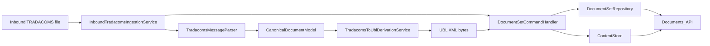
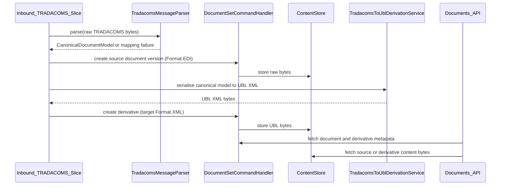

## Overview

This slice adds a narrow inbound TRADACOMS processing path that lands the original payload in the documents domain as the source document version, immediately derives a UBL XML representation, and exposes both payloads through the existing Documents API hierarchy. The implementation stays inside the current application plane by reusing `DocumentSet`, `DocumentVersion`, `Derivative`, and `ContentStore` rather than introducing a parallel storage model.

The main design decision is to treat TRADACOMS as the authoritative source artefact and UBL as a generated derivative. That preserves evidential fidelity, aligns with the existing documents ubiquitous language, and lets downstream consumers choose between original EDI and canonical XML without duplicating document identity.

## Architecture

The first slice keeps the flow synchronous from ingestion through derivative creation so a successfully processed inbound file is immediately visible as a source document plus a UBL derivative. This reduces the first-slice blast radius by avoiding a second asynchronous consistency boundary.





Design choices:

- Source content and derivative content both use the existing content-addressable store.
- UBL derivation happens only after the source version is durably registered.
- Content access stays under the existing `/api/document-sets/...` API family rather than adding a separate download service.
- Parser, canonical model mapper, and UBL serialiser are separated so later TRADACOMS message types can plug in without reshaping the documents domain.

## Components and Interfaces

### 1. InboundTradacomsIngestionService

Application-layer orchestrator that accepts raw bytes and envelope metadata from the inbound file processor.

Responsibilities:

- classify whether the file is a supported first-slice TRADACOMS document
- parse the file into a canonical document model
- create the source document and source version in the documents domain
- invoke UBL derivation for successful mappings
- record translation failure state when UBL cannot be produced

Proposed interface:

```java
public interface InboundTradacomsIngestionService {
    TradacomsIngestionResult ingest(TradacomsInboundRequest request);
}
```

### 2. TradacomsMessageParser

Pure parsing and extraction component for the supported TRADACOMS grammar.

Responsibilities:

- validate the inbound payload is structurally TRADACOMS
- identify the supported message type
- extract mapped business fields into `CanonicalDocumentModel`
- return structured mapping failures without mutating document state

Proposed interface:

```java
public interface TradacomsMessageParser {
    TradacomsParseResult parse(byte[] payload);
}
```

### 3. TradacomsToUblDerivationService

Pure transformation component that turns the canonical model into UBL XML bytes.

Responsibilities:

- select the UBL document shape for the supported message type
- serialise mapped fields into UBL XML
- expose a deterministic transformation label such as `TRADACOMS_TO_UBL`

Proposed interface:

```java
public interface TradacomsToUblDerivationService {
    UblDerivationResult derive(CanonicalDocumentModel model);
}
```

### 4. Documents content query path

The existing `DocumentSetController` currently exposes metadata only. This slice adds content retrieval endpoints inside the same controller family.

Proposed endpoints:

- `GET /api/document-sets/{setId}/documents/{docId}/versions/{versionNumber}/content`
- `GET /api/document-sets/{setId}/documents/{docId}/derivatives/{derivativeId}/content`

Response contract:

- raw bytes in the response body
- explicit media type and/or format metadata headers
- document identifiers and content hash headers for traceability

### 5. DocumentSetCommandHandler extension

The existing command handler already supports source versions and derivatives. This slice extends the orchestration layer, not the aggregate rules:

- create source versions with `Format.EDI`
- create UBL derivatives with `Format.XML`
- preserve the existing uniqueness rule of one derivative per source version and target format

### 6. Content retrieval service

Add a query-oriented service that resolves a document version or derivative to stored content bytes through `ContentStore`.

Proposed interface:

```java
public interface DocumentContentQueryService {
    RetrievedContent getVersionContent(DocumentSetId setId, DocumentId documentId, int versionNumber);
    RetrievedContent getDerivativeContent(DocumentSetId setId, DocumentId documentId, DerivativeId derivativeId);
}
```

## Data Models

### TradacomsInboundRequest

```java
public record TradacomsInboundRequest(
    byte[] payload,
    String tenantId,
    String sourceFileName,
    String receivedBy,
    Map<String, String> interchangeMetadata
) {}
```

### CanonicalDocumentModel

An internal value object representing the mapped business meaning shared between the parser and UBL serialiser. The first slice should include only the fields needed for the supported message type, for example:

```java
public record CanonicalDocumentModel(
    DocumentType documentType,
    String businessDocumentNumber,
    LocalDate issueDate,
    String buyerReference,
    String supplierReference,
    List<CanonicalLineItem> lineItems,
    Map<String, String> mappedAttributes
) {}
```

### TradacomsIngestionResult

```java
public record TradacomsIngestionResult(
    UUID documentSetId,
    UUID documentId,
    int sourceVersionNumber,
    UUID derivativeId,
    TranslationStatus translationStatus,
    List<String> translationErrors
) {}
```

`TranslationStatus` values:

- `SUCCESS`
- `UNSUPPORTED_MESSAGE`
- `MAPPING_FAILED`
- `UBL_SERIALISATION_FAILED`

### RetrievedContent

```java
public record RetrievedContent(
    byte[] bytes,
    Format format,
    String contentHash,
    String contentType,
    String fileName
) {}
```

### Documents API DTO adjustments

Existing DTOs remain the metadata entry point, with minimal additions:

- `DocumentVersionResponse` gains `format`
- `DerivativeResponse` continues to expose `targetFormat` and `transformationMethod`
- new content response path returns `RetrievedContent` through `ResponseEntity<byte[]>`

## Correctness Properties

*A property is a characteristic or behavior that should hold true across all valid executions of a system — essentially, a formal statement about what the system should do. Properties serve as the bridge between human-readable specifications and machine-verifiable correctness guarantees.*

### Prework Analysis

1.1 Create document set and source version for supported message  
Thoughts: This is a general ingestion rule across all supported inputs. Generate valid supported messages and assert a source document set and version exist after ingestion.  
Testable: yes - property

1.2 Preserve raw payload bytes exactly as received  
Thoughts: This is a byte-preservation invariant and ideal for property testing with arbitrary byte payloads constrained to valid TRADACOMS examples.  
Testable: yes - property

1.3 Source metadata identifies EDI content  
Thoughts: This is deterministic metadata emitted for every successfully stored source version. It fits a property over all successful ingestions.  
Testable: yes - property

2.1 Generate one UBL derivative for stored source version  
Thoughts: This applies to every successfully mapped source document. Property test can assert derivative count and target format.  
Testable: yes - property

2.2 Link UBL derivative to source document version  
Thoughts: Provenance relationship should hold for all successful derivations. Property test can compare derivative sourceVersionId to created version id.  
Testable: yes - property

2.3 Serialise UBL derivative as XML content  
Thoughts: This is a deterministic output-format invariant for every successful derivation.  
Testable: yes - property

2.4 Parse to canonical model, serialise to UBL, reparse to equivalent canonical model  
Thoughts: This is the highest-value round-trip property and should be tested generatively over supported canonical documents or supported TRADACOMS fixtures.  
Testable: yes - property

3.1 Document retrieval includes current source version and derivatives  
Thoughts: This is an API projection rule. Example tests are sufficient because it validates response shape at the adapter boundary.  
Testable: yes - example

3.2 Derivative listing includes UBL derivative  
Thoughts: This is a specific retrieval scenario that can be covered in example-style API tests.  
Testable: yes - example

3.3 Derivative metadata identifies TRADACOMS-to-UBL transformation  
Thoughts: This is a deterministic metadata rule for all successful derivations and can be folded into the general derivative property.  
Testable: yes - property

4.1 Source content request returns stored raw payload  
Thoughts: This is a retrieval round-trip invariant across all stored source payloads.  
Testable: yes - property

4.2 Derivative content request returns stored UBL payload  
Thoughts: This is another retrieval round-trip invariant across all generated derivatives.  
Testable: yes - property

4.3 Source content is identified as EDI  
Thoughts: This is deterministic metadata paired with 4.1, so it should be covered by the same property.  
Testable: yes - property

4.4 Derivative content is identified as XML  
Thoughts: This is deterministic metadata paired with 4.2, so it should be covered by the same property.  
Testable: yes - property

5.1 Preserve source document when mapping fails  
Thoughts: This is a failure-mode invariant. Generate unmappable but still storable payloads and verify source persistence with failure status.  
Testable: yes - property

5.2 Record translation failure against processing result  
Thoughts: This is deterministic state emission for every failed mapping or serialisation case and can be covered with the same failure property.  
Testable: yes - property

5.3 API must not report a successful UBL derivative when none exists  
Thoughts: This is a projection of failure state to the API. Example tests at the controller boundary are sufficient.  
Testable: yes - example

### Property Reflection

The raw-payload persistence and source-content retrieval criteria are redundant if tested separately because a single round-trip property can validate creation, storage, retrieval, and format metadata together. The successful-derivation criteria also collapse into one provenance property that validates derivative existence, source linkage, XML format, and transformation label. The failure criteria collapse into one preservation property covering source retention, failure status, and derivative absence. API response-shape checks remain as example tests because they verify adapter projection rather than core computational behaviour.

### Property 1: Source payload round trip preserves bytes and format

*For any* supported TRADACOMS payload accepted by the ingestion flow, storing the payload as a source document and then retrieving the source version content through the Documents_API should return byte-for-byte identical content marked as `Format.EDI`.

**Validates: Requirements 1.1, 1.2, 1.3, 4.1, 4.3**

### Property 2: Successful derivation produces one linked XML derivative

*For any* supported TRADACOMS payload that can be mapped into the canonical model, ingestion should produce exactly one UBL derivative whose source version reference matches the created source version, whose transformation label is `TRADACOMS_TO_UBL`, and whose target format is `Format.XML`.

**Validates: Requirements 2.1, 2.2, 2.3, 3.3**

### Property 3: Canonical model survives TRADACOMS to UBL round trip

*For any* canonical document instance within the supported first-slice message shape, serialising that instance to TRADACOMS, parsing the TRADACOMS payload, serialising the parsed model to UBL, and reparsing the UBL output should produce an equivalent canonical document for all mapped business fields.

**Validates: Requirements 2.4**

### Property 4: Derivative content round trip preserves bytes and XML identity

*For any* successfully derived UBL document, retrieving derivative content through the Documents_API should return byte-for-byte identical content marked as `Format.XML`.

**Validates: Requirements 4.2, 4.4**

### Property 5: Translation failure preserves source evidence and suppresses false success

*For any* received TRADACOMS payload that cannot be mapped or serialised into UBL, the ingestion result should retain the stored source payload, report a non-success translation status with at least one failure detail, and expose no successful UBL derivative.

**Validates: Requirements 5.1, 5.2, 5.3**

## Error Handling

Failure modes and handling:

- Unsupported or invalid TRADACOMS syntax: reject translation, preserve raw payload only when the payload is still accepted for evidential storage, and return `UNSUPPORTED_MESSAGE` or `MAPPING_FAILED` from the ingestion result.
- Content store write failure for source payload: fail the whole ingestion request because no evidential source exists yet.
- UBL derivation failure after source persistence: keep the source document, record `UBL_SERIALISATION_FAILED`, and do not create derivative metadata.
- Missing content on retrieval: return `404 Not Found` from content endpoints when metadata exists but bytes are unavailable, and log a high-severity operational event because metadata and content store have diverged.
- Duplicate derivative creation attempts: rely on the existing documents aggregate rule that prevents more than one derivative per source version and target format.

Operational safety decisions:

- No retry is added for parsing or mapping failures because they are permanent input problems.
- Additional retries are not layered on top of content-store implementations when the underlying platform SDK already retries transient I/O.
- The data plane remains readable from stored document metadata and content even if later control-plane configuration changes occur.

## Testing Strategy

**Framework:** JUnit 5 and AssertJ for example-driven tests, `net.jqwik:jqwik` for property-based tests

**Test location:**

- parser and derivation properties in `support/tradacoms` or a new TRADACOMS-focused domain module test package
- documents API and content retrieval tests in `domains/documents/src/test/java`
- controller response-shape tests alongside existing `DocumentSetControllerTest`

**Unit tests:**

- successful ingestion example for one supported TRADACOMS fixture producing one source version and one UBL derivative
- controller examples for document retrieval, derivative listing, source-content download, and derivative-content download
- failure examples for unsupported message type, unmappable payload, missing stored content, and duplicate derivative prevention

**Property-based tests:**

For each correctness property:

- Property 1: Source payload round trip preserves bytes and format
  - Generator strategy: generate valid supported TRADACOMS message instances from a constrained builder that varies envelope references, business identifiers, dates, and line-item counts, then render them to bytes.
  - Edge cases to include in generators: minimum and maximum supported line counts, empty optional fields, repeated segment groups, and unusual but valid delimiter placements.
  - Tag: `Feature: tradacoms-to-ubl-documents, Property 1: Source payload round trip preserves bytes and format`
  - Minimum iterations: 100

- Property 2: Successful derivation produces one linked XML derivative
  - Generator strategy: reuse the valid supported message generator from Property 1 and assert the ingestion result plus persisted aggregate state.
  - Edge cases to include in generators: documents with optional parties omitted, single-line documents, and maximum supported mapped monetary precision.
  - Tag: `Feature: tradacoms-to-ubl-documents, Property 2: Successful derivation produces one linked XML derivative`
  - Minimum iterations: 100

- Property 3: Canonical model survives TRADACOMS to UBL round trip
  - Generator strategy: generate canonical-model instances directly inside the supported first-slice shape, serialise to TRADACOMS with a test formatter, parse, derive UBL, and reparse UBL to canonical form.
  - Edge cases to include in generators: boundary dates, zero-value optional amounts, repeated line descriptions, and identifier lengths at allowed limits.
  - Tag: `Feature: tradacoms-to-ubl-documents, Property 3: Canonical model survives TRADACOMS to UBL round trip`
  - Minimum iterations: 100

- Property 4: Derivative content round trip preserves bytes and XML identity
  - Generator strategy: derive UBL from generated canonical-model instances and retrieve stored derivative bytes through the content query service.
  - Edge cases to include in generators: namespace-heavy XML output, optional empty aggregates omitted from output, and single-line documents.
  - Tag: `Feature: tradacoms-to-ubl-documents, Property 4: Derivative content round trip preserves bytes and XML identity`
  - Minimum iterations: 100

- Property 5: Translation failure preserves source evidence and suppresses false success
  - Generator strategy: generate invalid mapping cases by mutating otherwise valid TRADACOMS messages to remove required mapped fields or inject unsupported segment combinations while keeping the payload storable.
  - Edge cases to include in generators: missing business identifier, unknown code values, structurally valid but semantically incomplete line items, and UBL serialisation failure hooks.
  - Tag: `Feature: tradacoms-to-ubl-documents, Property 5: Translation failure preserves source evidence and suppresses false success`
  - Minimum iterations: 100

Tests should prefer real domain objects and in-memory adapters over mocks so the parser, mapper, derivation service, and document aggregate collaborate naturally. Only port boundaries such as external file ingress or persistent content storage should use test doubles where needed.
