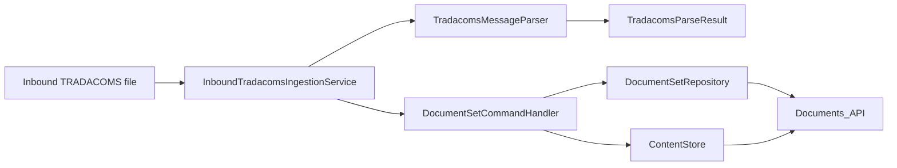
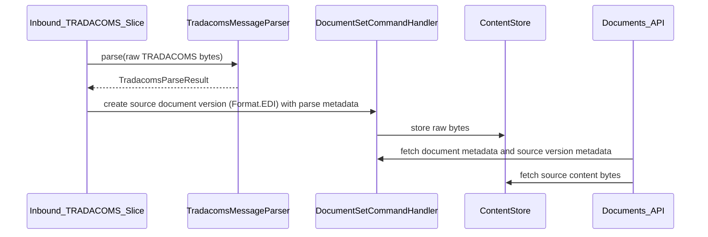

## Overview

This slice adds a narrow inbound TRADACOMS processing path that lands the original payload in the documents domain as the source document version, validates and parses the payload into a first-slice parsed result, and exposes the stored source payload through the existing Documents API hierarchy. The implementation stays inside the current application plane by reusing `DocumentSet`, `DocumentVersion`, and `ContentStore` rather than introducing a parallel storage model.

The main design decision is to treat TRADACOMS as the only artefact in scope for this slice. We persist the raw source, record whether parsing succeeded and what message type was identified, and defer any canonical model or UBL derivative work until the ingestion path is proven.

## Architecture

The first slice keeps the flow synchronous from ingestion through parsing and source-document registration so a successfully accepted inbound file is immediately visible as a source document with parse metadata. This reduces the first-slice blast radius by avoiding derivative generation and a second consistency boundary.





Design choices:

- Source content uses the existing content-addressable store.
- Parsing happens before document registration so the stored metadata reflects the parser outcome at creation time.
- Content access stays under the existing `/api/document-sets/...` API family rather than adding a separate download service.
- The parser returns structured parse results and errors without mutating document state.
- UBL generation, derivatives, and canonical model persistence are out of scope for this slice.

## Components and Interfaces

### 1. InboundTradacomsIngestionService

Application-layer orchestrator that accepts raw bytes and envelope metadata from the inbound file processor.

Responsibilities:

- classify whether the file is a supported first-slice TRADACOMS document
- parse the file and capture structured parse outcomes
- create the source document and source version in the documents domain
- record parse status and parse errors on the stored document metadata

Proposed interface:

```java
public interface InboundTradacomsIngestionService {
    TradacomsIngestionResult ingest(TradacomsInboundRequest request);
}
```

### 2. TradacomsMessageParser

Pure parsing and extraction component for the supported TRADACOMS grammar.

Responsibilities:

- validate the inbound payload is structurally TRADACOMS
- identify the supported message type
- extract the minimal parsed metadata needed by the first slice
- return structured parse failures without mutating document state

Proposed interface:

```java
public interface TradacomsMessageParser {
    TradacomsParseResult parse(byte[] payload);
}
```

### 3. Documents content query path

The existing `DocumentSetController` currently exposes metadata only. This slice adds source-content retrieval inside the same controller family.

Proposed endpoint:

- `GET /api/document-sets/{setId}/documents/{docId}/versions/{versionNumber}/content`

Response contract:

- raw bytes in the response body
- explicit media type and/or format metadata headers
- document identifiers and content hash headers for traceability

### 4. DocumentSetCommandHandler extension

The existing command handler already supports source versions. This slice extends the orchestration layer, not the aggregate rules:

- create source versions with `Format.EDI`
- attach parse metadata for supported message type, parse status, and parse errors where available

### 5. Content retrieval service

Add a query-oriented service that resolves a document version to stored content bytes through `ContentStore`.

Proposed interface:

```java
public interface DocumentContentQueryService {
    RetrievedContent getVersionContent(DocumentSetId setId, DocumentId documentId, int versionNumber);
}
```

## Data Models

### TradacomsInboundRequest

```java
public record TradacomsInboundRequest(
    byte[] payload,
    String tenantId,
    String sourceFileName,
    String receivedBy,
    Map<String, String> interchangeMetadata
) {}
```

### TradacomsParseResult

```java
public record TradacomsParseResult(
    ParseStatus status,
    String messageType,
    String businessDocumentNumber,
    List<String> errors
) {}
```

`ParseStatus` values:

- `SUCCESS`
- `UNSUPPORTED_MESSAGE`
- `INVALID_SYNTAX`

### TradacomsIngestionResult

```java
public record TradacomsIngestionResult(
    UUID documentSetId,
    UUID documentId,
    int sourceVersionNumber,
    ParseStatus parseStatus,
    String messageType,
    List<String> parseErrors
) {}
```

### RetrievedContent

```java
public record RetrievedContent(
    byte[] bytes,
    Format format,
    String contentHash,
    String contentType,
    String fileName
) {}
```

### Documents API DTO adjustments

Existing DTOs remain the metadata entry point, with minimal additions:

- `DocumentVersionResponse` gains `format`
- document or version metadata gains `parseStatus`, `messageType`, and parse errors when present
- new content response path returns `RetrievedContent` through `ResponseEntity<byte[]>`

## Correctness Properties

*A property is a characteristic or behavior that should hold true across all valid executions of a system — essentially, a formal statement about what the system should do. Properties serve as the bridge between human-readable specifications and machine-verifiable correctness guarantees.*

### Prework Analysis

1.1 Create document set and source version for supported message  
Thoughts: This is a general ingestion rule across all supported inputs. Generate valid supported messages and assert a source document set and version exist after ingestion.  
Testable: yes - property

1.2 Preserve raw payload bytes exactly as received  
Thoughts: This is a byte-preservation invariant and ideal for property testing with arbitrary payload variants constrained to valid TRADACOMS examples.  
Testable: yes - property

1.3 Source metadata identifies EDI content  
Thoughts: This is deterministic metadata emitted for every successfully stored source version. It fits a property over all successful ingestions.  
Testable: yes - property

2.1 Parse supported TRADACOMS payloads into structured results  
Thoughts: This is the core parser behaviour for the first slice and suits a property over generated supported messages.  
Testable: yes - property

2.2 Record identified message type on the stored document  
Thoughts: This is deterministic metadata projected from the parse result into the stored document metadata.  
Testable: yes - property

2.3 Record parse failure without losing source evidence  
Thoughts: This is a failure-mode invariant and should be covered with generated invalid or unsupported payloads.  
Testable: yes - property

3.1 Document retrieval includes current source version metadata  
Thoughts: This is an API projection rule. Example tests are sufficient because it validates response shape at the adapter boundary.  
Testable: yes - example

3.2 Source content request returns stored raw payload  
Thoughts: This is a retrieval round-trip invariant across all stored source payloads.  
Testable: yes - property

### Property Reflection

The creation, storage, retrieval, and source-format metadata criteria collapse well into one round-trip property. The successful parsing rules collapse into one metadata propagation property that validates parse status, identified message type, and stored source visibility. The failure rules collapse into one preservation property covering source retention plus surfaced parse failure details. API response-shape checks remain as example tests because they validate adapter projection rather than core computational behaviour.

### Property 1: Source payload round trip preserves bytes and format

*For any* supported TRADACOMS payload accepted by the ingestion flow, storing the payload as a source document and then retrieving the source version content through the Documents_API should return byte-for-byte identical content marked as `Format.EDI`.

### Property 2: Successful parsing records source metadata consistently

*For any* supported TRADACOMS payload that parses successfully, ingesting the payload should produce stored document metadata whose parse status is `SUCCESS` and whose message type matches the parser result.

### Property 3: Parse failures preserve source evidence and surface failure details

*For any* TRADACOMS payload that is storable but invalid or unsupported for the first slice, ingesting the payload should preserve the source document, record a non-success parse status, and surface parse errors without creating any derived artefacts.

**Validates: Requirements 5.1, 5.2**

## Error Handling

Failure modes and handling:

- Unsupported or invalid TRADACOMS syntax: preserve the raw payload when the inbound file is accepted for evidential storage, and return `UNSUPPORTED_MESSAGE` or `INVALID_SYNTAX` from the ingestion result.
- Content store write failure for source payload: fail the whole ingestion request because no evidential source exists yet.
- Missing content on retrieval: return `404 Not Found` from content endpoints when metadata exists but bytes are unavailable, and log a high-severity operational event because metadata and content store have diverged.

Operational safety decisions:

- No retry is added for parsing failures because they are permanent input problems.
- Additional retries are not layered on top of content-store implementations when the underlying platform SDK already retries transient I/O.
- The data plane remains readable from stored document metadata and content even if later control-plane configuration changes occur.

## Testing Strategy

**Framework:** JUnit 5 and AssertJ for example-driven tests, `net.jqwik:jqwik` for property-based tests

**Test location:**

- parser properties in `support/tradacoms` or a new TRADACOMS-focused domain module test package
- documents API and content retrieval tests in `domains/documents/src/test/java`
- controller response-shape tests alongside existing `DocumentSetControllerTest`

**Unit tests:**

- successful ingestion example for one supported TRADACOMS fixture producing one source version with parse metadata
- controller examples for document retrieval and source-content download
- failure examples for unsupported message type, invalid syntax, and missing stored content

**Property-based tests:**

For each correctness property:

- Property 1: Source payload round trip preserves bytes and format
  - Generator strategy: generate valid supported TRADACOMS message instances from a constrained builder that varies envelope references, business identifiers, dates, and line-item counts, then render them to bytes.
  - Edge cases to include in generators: minimum and maximum supported line counts, empty optional fields, repeated segment groups, and unusual but valid delimiter placements.
  - Tag: `Feature: tradacoms-documents-ingestion, Property 1: Source payload round trip preserves bytes and format`
  - Minimum iterations: 100

- Property 2: Successful parsing records source metadata consistently
  - Generator strategy: reuse the valid supported message generator from Property 1 and assert the ingestion result plus persisted aggregate state.
  - Edge cases to include in generators: documents with optional parties omitted, single-line documents, and boundary identifier lengths.
  - Tag: `Feature: tradacoms-documents-ingestion, Property 2: Successful parsing records source metadata consistently`
  - Minimum iterations: 100

- Property 3: Parse failures preserve source evidence and surface failure details
  - Generator strategy: generate invalid parse cases by mutating otherwise valid TRADACOMS messages to break syntax or inject unsupported segment combinations while keeping the payload storable.
  - Edge cases to include in generators: missing business identifier, unknown code values, structurally valid but semantically incomplete line items, and unsupported message types.
  - Tag: `Feature: tradacoms-documents-ingestion, Property 3: Parse failures preserve source evidence and surface failure details`
  - Minimum iterations: 100

Tests should prefer real domain objects and in-memory adapters over mocks so the parser and document aggregate collaborate naturally. Only port boundaries such as external file ingress or persistent content storage should use test doubles where needed.
